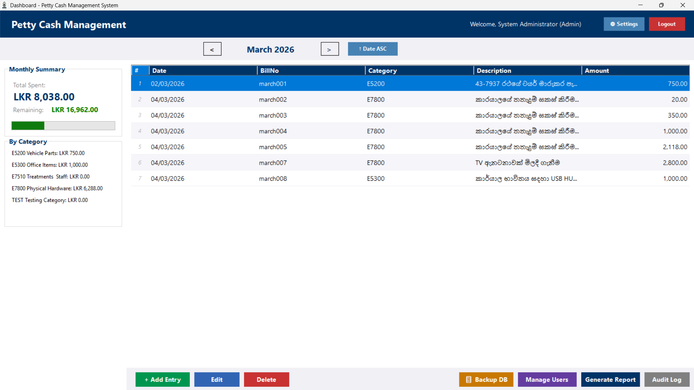
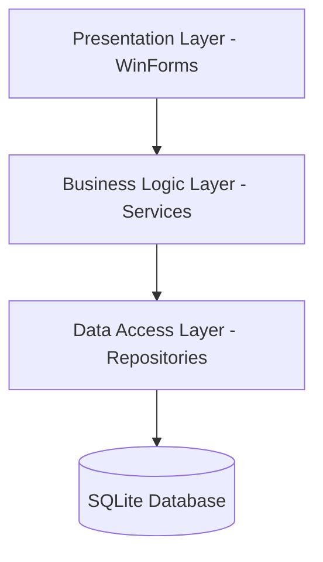

# 💰 Petty Cash Management System
### Ceylon Electricity Board — Haliela Branch

  
   
  <i>Central Dashboard showing Real-time Monthly Summaries and Expense Tracking</i>

> A robust desktop application custom-built for **CEB Haliela** to streamline petty cash management. It enforces strict business rules, provides role-based access control, and generates automated financial reports.

---

## 📽️ Visual Walkthrough

### 🚀 Core Experience
| Authentication | Expense Management |
|:---:|:---:|
|  |  |
| Secure login with encrypted sessions | Dynamic entry forms with rule validation |

### 📊 Reporting & Export
| Professional Reporting | Excel Integration |
|:---:|:---:|
|  |  |
| Real-time Sinhala & English HTML formats | One-click export with live formulas |

### 🔐 Administrative Control
| User Management | Permissions Engine | Category Logic |
|:---:|:---:|:---:|
|  |  |  |
| Manage staff accounts | 22+ granular permissions | Dynamic expense categories |

### 🛡️ System Maintenance
| Advanced Audit Trail | Disaster Recovery | Setup Wizard |
|:---:|:---:|:---:|
|  |  |  |
| Traceable history of all actions | Simple SQLite backup/restore | Professional Inno Setup installer |

---

## ✨ Key Features

### 💎 Core Functionality
- **Dynamic Dashboard** — Real-time progress bars and category-wise spending breakdowns.
- **Rules Engine** — Automatic enforcement of LKR 25,000 monthly caps and LKR 5,000 bill limits.
- **Smart Validation** — Prevents duplicate bill numbers, future dates, and invalid entries.
- **Universal Reporting** — Professional HTML reports that sync perfectly with official CEB formats.
- **Local-First Reliability** — Powered by SQLite for 100% offline, zero-config deployment.

### 🏛️ System Architecture (3-Tier)

---

## 🚀 Getting Started

### Option 1: Direct Installation (Recommended)
1. Download `PettyCashSetup.exe` from the latest release.
2. Follow the installation wizard.
3. Launch and login with the default credentials.

### Option 2: Build from Source
1. Open `.sln` in **Visual Studio 2022**.
2. Restore NuGet packages (`System.Data.SQLite`, `BCrypt.Net-Next`, `ClosedXML`).
3. Press `F5` to Run.

**Default Login:** `admin` / `admin123` *(Change immediately!)*

---

## 🛠️ Technology Stack

| Component | Technology |
|---|---|
| **Language** | VB.NET (.NET 8.0) |
| **UI Framework** | Windows Forms (WinForms) |
| **Database** | SQLite 3 |
| **Installer** | Inno Setup 6 |
| **Exporting** | ClosedXML (Excel) |
| **Security** | BCrypt.Net-Next (Hashing) |

---

## 📖 Project Context
This application was developed as a part of my **NDICT NVQ Level 5** assessment and **On-the-Job Training** at **Ceylon Electricity Board — Haliela**. It solves real-world workflow bottleneck by digitizing a manual ledger system.

> [!NOTE]
> This project was developed with significant assistance from **AI Pair Programming** (Gemini/Antigravity). You can read about the full development process in the [Development Journey](DEVELOPMENT_JOURNEY.md).

---

## 📞 Contact & Support
- **Developer:** Theekshana
- **Supervisor:** ES Sir (CEB Haliela)
- **Status:** Final Release v1.3.0

**Last Updated:** March 30, 2026
ed)
- **Pull Requests**: Use provided templates in `.github/pull_request_template.md`
- **Code of Conduct**: See [CODE_OF_CONDUCT.md](CODE_OF_CONDUCT.md)
- **Security**: See [SECURITY.md](SECURITY.md) for vulnerability reporting

### CI/CD & Automation

- ✅ **Build & Test**: Automated on every push via GitHub Actions
- 🔍 **Code Analysis**: CodeQL security scanning enabled
- 📦 **Dependencies**: Automated dependency updates via Dependabot
- 🏷️ **Releases**: Follow [Release Process](.github/RELEASE.md)

---

## 🛠️ Tech Stack

| Component | Technology |
|-----------|-----------|
| Language | VB.NET |
| Framework | .NET 8.0 (Windows Forms) |
| Database | SQLite 3 |
| IDE | Visual Studio 2022 |
| Installer | Inno Setup |
| Password Hashing | BCrypt.Net-Next |
| Excel Export | ClosedXML |
| AI Assistant | Google Gemini / Antigravity |

---

## 📞 Contact

- **Developer:** Theekshana
- **Organization:** Ceylon Electricity Board — Haliela Branch
- **Supervisor:** ES Sir
- **Course:** NVQ Level 5 — NDICT (National Diploma in ICT)

---

**Last Updated:** March 28, 2026
