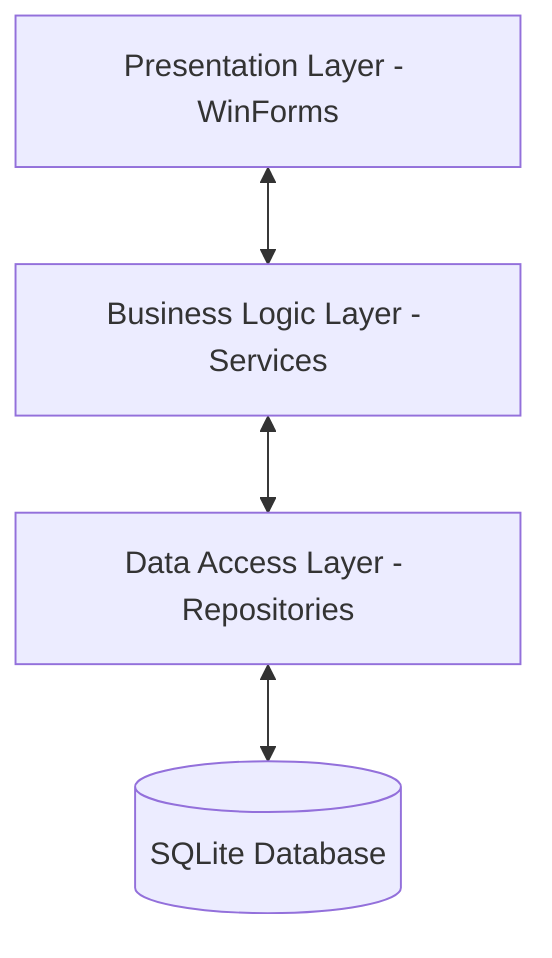

# 🏗️ System Architecture

This project follows a professional **3-Tier Architecture** pattern. This section explains how the different parts of the application interact with each other.

---

## 🏛️ High-Level Design

The application is divided into three distinct layers to ensure that the code is organized, maintainable, and easy to test.

### 1. Presentation Layer (`PettyCash.DesktopApp/Forms`)
- **Responsibility:** Handles the User Interface (UI) and user interactions.
- **Components:** `LoginForm`, `DashboardForm`, `ExpenseEntryForm`, etc.
- **Behavior:** Captures user input and displays data. It **never** talks directly to the database; it always asks the Service layer for data.

### 2. Business Logic Layer (`PettyCash.DesktopApp/Services`)
- **Responsibility:** Enforces business rules and processes data.
- **Components:** `ValidationService`, `ExpenseService`, `AuthService`, etc.
- **Behavior:** This is the "brain" of the app. It calculates totals, checks if an expense follows the rules (BR1-BR8), and hashes passwords.

### 3. Data Access Layer (`PettyCash.DesktopApp/Repositories`)
- **Responsibility:** Manages communication with the SQLite database.
- **Components:** `ExpenseRepository`, `UserRepository`, `DbContext`.
- **Behavior:** Executes SQL queries (SELECT, INSERT, UPDATE, DELETE). It doesn't care about business rules; it just saves and retrieves what it's told.

---

## 🔄 Data Flow Example: Adding an Expense

When a user clicks "Save" on a new expense, the following flow occurs:

1. **Forms:** `ExpenseEntryForm` collects the data and creates an `Expense` object.
2. **Services:** The form calls `ExpenseService.AddExpense()`.
3. **Validation:** `ExpenseService` calls `ValidationService.Validate()` to check:
    - Is the amount > 0?
    - Is the monthly limit exceeded?
    - Is the description long enough?
4. **Repositories:** If valid, `ExpenseService` calls `ExpenseRepository.Save()`.
5. **Database:** `ExpenseRepository` runs the SQL command to insert the row into `PettyCash.db`.
6. **Result:** A success/fail message travels back up to the UI to inform the user.

---

## 📅 Decoupled Reporting Architecture

A key feature of the system is the decoupling of the **Transaction Date** from the **Report Month**.

### Cross-Month Posting Logic
- **Database Schema:** The `petty_cash_entries` table includes explicit `report_month` and `report_year` columns.
- **Filtering:** All dashboard and report queries filter by these columns, **not** the `entry_date`.
- **The "December Rule":** This architecture allows expenses dated Dec 15–31 to be assigned to a **January** report month for annual processing.
- **Persistence:** When an entry is edited, the system preserves the originally assigned `report_month` even if the user changes the `entry_date`.

---

## 🛠️ Design Patterns Used

- **Repository Pattern:** Decouples the database logic from the rest of the application. If we move from SQLite to another database in the future, we only need to change the Repository layer.
- **Service Layer:** Centralizes common business logic so it's not scattered across different forms.
- **Dependency Injection (Manual):** Services and Repositories are passed into constructors to allow for easier testing (though implemented manually in this project).

---

## 📦 Core Directory Structure

- `Forms/`: UI design and event handling
- `Services/`: Logic, calculations, and rules
- `Repositories/`: SQL queries and database connection
- `Models/`: Simple data structures (Entities) like `User` or `Expense`
- `Utilities/`: Shared helpers like `SessionManager` or `Constants`
